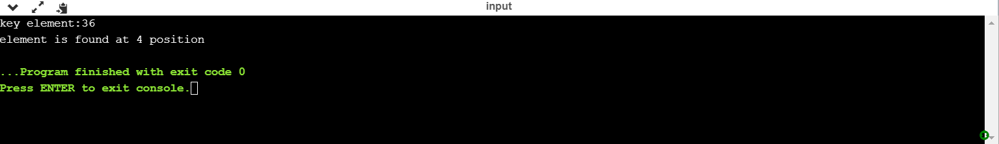
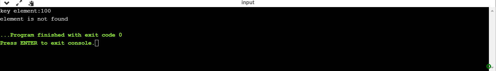
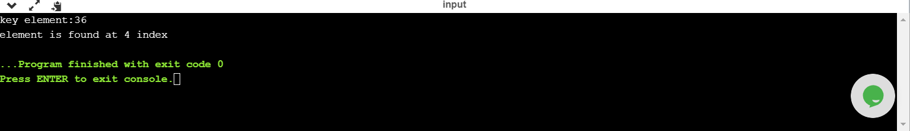
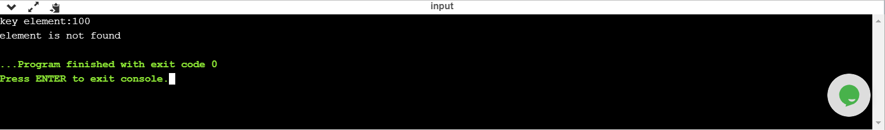

# Aim of the Experiment:

Write a programme to use both recursive and non - recursive functions to perform the following searching operations for a key value in a given list of integers:
i) Linear search   ii) Binary search

# Description: 
linear search or sequential search is a method for finding an element within a array.It sequentially checks each element of the array until the match is found.In this process the whole array will be searched.

Binary search is also known as logarithmic search,is a search algorithm that finds the position of the target value within the sorted array.Binary search compares the target value to the middle element of the array.

# Procedure:
## linear search by non - recursive function
 Declare an array named "a" of size 10 in the main function.
 
 Declare the variables i and key element as integers.
 
 Scan the value of the key element.
 
 By using for loop initialize the value of i as 0 ,iterate the value of i by adding 1 until the value of i reaches 9 in the linear_search function.
 
 By checking the each element using for loop ,if the element is present then print the index of the element to the output.
 
 Else print that the element is not present to the output.

# Output:
Output 1(key element = 36): The element 36 is made to match with every element in the array.When it reaches the 4th index element it matches and returns the position of the key element in the array(4). 

Output 2(key element = 100): The element 100 is made to match with every element in the array.As the element does not match with the elements in the array it returns that element is not found.

# Output Obtained:

[iterative linear.txt](https://github.com/tejaswini1108/II-IT-B-LAB/files/5091263/iterative.linear.txt)

# Procedure:
## Binary search by non - recursive function
Declare an array named "a" of size 10 in the main function.

In binary search we need to sort the elements.

Declare the variables element,mid and initialize the values of i=0 and n=9.

Scan the value of the element.

find the mid value as i + n / 2.

Then there will be three cases.

case 1: if the mid = element return mid value.

case 2: if the mid > element return n = mid - 1.

case 3: if the mid < element return i = mid + 1.

we have to continue the process until the key element is found or search space is exhausted.

# Output:

Output 1(key element = 12):Mid value = 0+9/2 = 4.5 . In this case the mid > element then n = mid - 1 and the procedure will continue until the key element matches with the mid position then we will get the index of the key elment as 1.

Output 2(key element = 92):As the mid value = 4.5 .In this case the mid < element then i = mid + 1 and the procedure will continue until the key element matches with the mid position then we will get the index of the key elment as 8.

Output 3(key element = 33)::As the mid value = 4.5 .In this case the mid > element then n = mid - 1 and the procedure will continue until the key element matches with the mid position then we will get the index of the key elment as 3.

# Output Obtained:

[iterative binary.txt](https://github.com/tejaswini1108/II-IT-B-LAB/files/5091262/iterative.binary.txt)

# Procedure:
## Linear search using recursive function
In the linear search function declare the variables a,element,i,n,index.Which is a user defined function.

check every element in the array until the value of i is less than or equal to n.

if the key element matches with the element in the array then return the value of index to the main function.

Else repeat the procedure by incrementing the value of i by 1 everytime.

if the value of i reaches the value greater than n then return -1 to the main function.

In the main function declare the variables and scan the value of the element.

if the value of index is equal to -1 then print element is not found to the output.

Else print the index of the element to the output.

# Output:
Output 1(key element = 36):  The element 36 is made to match with every element in the array.When it reaches the 4th index element it matches and returns the position of the key element in the array(4). 

Output 2(key element = 100): The element 100 is made to match with every element in the array.As the element does not match with the elements in the array it returns that element is not found.

# Output Obtained:

[recur linear.txt](https://github.com/tejaswini1108/II-IT-B-LAB/files/5078549/recur.linear.txt)

# Procedure:
## Binary search using recursive function
In binary search we need to sort the given array.

Consider a key element. Here the starting index is 0 and ending index is 9.

Find the mid value by start + end /2.Compare the keyelement and mid value by using binarysearch function declared.

Then there will be three cases.

case 1: if the mid = element return mid value
.
case 2: if the mid > element return n = mid - 1.

case 3: if the mid < element return i = mid + 1.

we have to continue the process until the key element is found or search space is exhausted.

# Output:
Output 1(key element = 12):Mid value = 0+9/2 = 4.5 . In this case the mid > element then n = mid - 1 and the procedure will continue until the key element matches with the mid position then we will get the index of the key elment as 1.

Output 2(key element = 92):As the mid value = 4.5 .In this case the mid < element then i = mid + 1 and the procedure will continue until the key element matches with the mid position then we will get the index of the key elment as 8.

Output 3(key element = 33)::As the mid value = 4.5 .In this case the mid > element then n = mid - 1 and the procedure will continue until the key element matches with the mid position then we will get the index of the key elment as 3.

# Output Obtained:

[recur binary n.txt](https://github.com/tejaswini1108/II-IT-B-LAB/files/5080365/recur.binary.n.txt)

